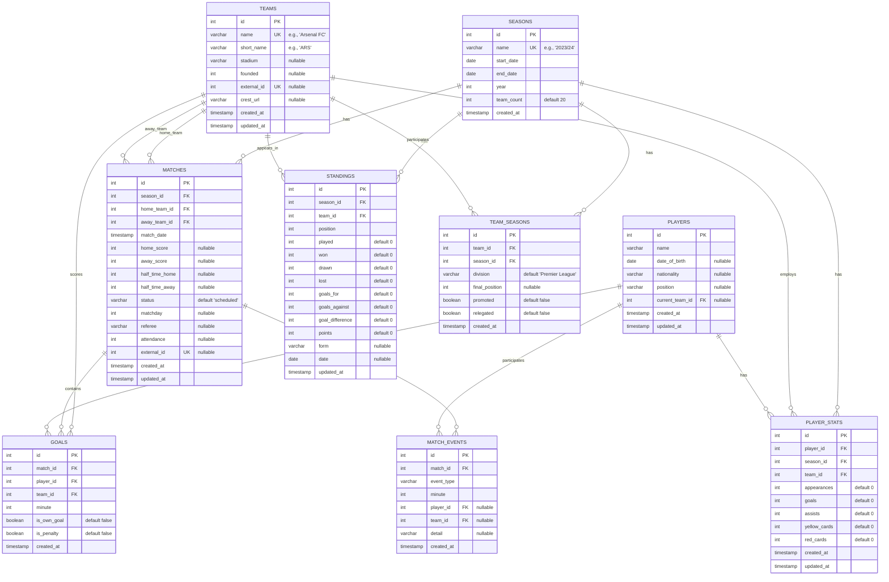

# PremStats Database Schema Documentation

## Overview

The PremStats database is designed to store comprehensive Premier League historical data from 1993/94 to present. The schema supports match results, team information, player statistics, and historical tracking across seasons.

## Database Statistics

- **Total Matches**: 12,786 (33 complete seasons)
- **Teams**: 51 (all teams that have played in Premier League)
- **Players**: 944 (with current team tracking)
- **Seasons**: 1992/93 to 2024/25 (33 seasons with data)
- **Database Engine**: PostgreSQL 16
- **Last Updated**: 2025-01-12

## Schema Diagram

## Table Details

### Core Tables

#### `seasons`
Primary table for Premier League seasons.

| Column | Type | Constraints | Description |
|--------|------|-------------|-------------|
| `id` | `integer` | PRIMARY KEY | Auto-increment season ID |
| `name` | `varchar(50)` | UNIQUE, NOT NULL | Season name (e.g., "2023/24") |
| `start_date` | `date` | NOT NULL | Season start date |
| `end_date` | `date` | NOT NULL | Season end date |
| `year` | `integer` | | Starting year of season |
| `team_count` | `integer` | DEFAULT 20 | Number of teams in season |
| `created_at` | `timestamp` | DEFAULT NOW() | Record creation time |

**Data Coverage**: 34 seasons (1992/93 to 2025/26), 33 with match data

#### `teams`
Information about all Premier League teams (past and present).

| Column | Type | Constraints | Description |
|--------|------|-------------|-------------|
| `id` | `integer` | PRIMARY KEY | Auto-increment team ID |
| `name` | `varchar(100)` | UNIQUE, NOT NULL | Full team name |
| `short_name` | `varchar(50)` | | Abbreviated name (e.g., "ARS") |
| `stadium` | `varchar(100)` | NULLABLE | Home stadium name |
| `founded` | `integer` | NULLABLE | Year founded |
| `external_id` | `integer` | UNIQUE, NULLABLE | External API reference |
| `crest_url` | `varchar(255)` | NULLABLE | Team badge/logo URL |
| `created_at` | `timestamp` | DEFAULT NOW() | Record creation time |
| `updated_at` | `timestamp` | DEFAULT NOW() | Last update time |

**Data Coverage**: 51 teams including historical clubs (Wimbledon FC, Swindon Town FC, etc.)

#### `matches`
Historical match results and fixture data.

| Column | Type | Constraints | Description |
|--------|------|-------------|-------------|
| `id` | `integer` | PRIMARY KEY | Auto-increment match ID |
| `season_id` | `integer` | FOREIGN KEY | Reference to seasons table |
| `home_team_id` | `integer` | FOREIGN KEY | Home team reference |
| `away_team_id` | `integer` | FOREIGN KEY | Away team reference |
| `match_date` | `timestamp` | NOT NULL | Match date and time |
| `home_score` | `integer` | NULLABLE | Home team final score |
| `away_score` | `integer` | NULLABLE | Away team final score |
| `half_time_home` | `integer` | NULLABLE | Home team halftime score |
| `half_time_away` | `integer` | NULLABLE | Away team halftime score |
| `status` | `varchar(50)` | DEFAULT 'scheduled' | Match status |
| `matchday` | `integer` | NULLABLE | Gameweek number |
| `referee` | `varchar(100)` | NULLABLE | Match referee |
| `attendance` | `integer` | NULLABLE | Stadium attendance |
| `external_id` | `integer` | UNIQUE, NULLABLE | External API reference |

**Indexes**: 
- `idx_matches_date` on `match_date`
- `idx_matches_season` on `season_id`

**Data Coverage**: 12,786 matches across 33 seasons (1992/93 to 2024/25)

### Statistics & Analysis Tables

#### `standings`
League table positions and statistics.

| Column | Type | Constraints | Description |
|--------|------|-------------|-------------|
| `id` | `integer` | PRIMARY KEY | Auto-increment ID |
| `season_id` | `integer` | FOREIGN KEY | Season reference |
| `team_id` | `integer` | FOREIGN KEY | Team reference |
| `position` | `integer` | NOT NULL | League position |
| `played` | `integer` | DEFAULT 0 | Matches played |
| `won` | `integer` | DEFAULT 0 | Matches won |
| `drawn` | `integer` | DEFAULT 0 | Matches drawn |
| `lost` | `integer` | DEFAULT 0 | Matches lost |
| `goals_for` | `integer` | DEFAULT 0 | Goals scored |
| `goals_against` | `integer` | DEFAULT 0 | Goals conceded |
| `goal_difference` | `integer` | DEFAULT 0 | Goal difference |
| `points` | `integer` | DEFAULT 0 | League points |
| `form` | `varchar(10)` | NULLABLE | Recent form (e.g., "WWDLL") |
| `date` | `date` | NULLABLE | Table date (for historical snapshots) |

**Unique Constraint**: `(season_id, team_id, date)`

#### `goals`
Individual goal events within matches.

| Column | Type | Constraints | Description |
|--------|------|-------------|-------------|
| `id` | `integer` | PRIMARY KEY | Auto-increment goal ID |
| `match_id` | `integer` | FOREIGN KEY | Match reference |
| `player_id` | `integer` | FOREIGN KEY | Player who scored |
| `team_id` | `integer` | FOREIGN KEY | Scoring team |
| `minute` | `integer` | NOT NULL | Minute goal was scored |
| `is_own_goal` | `boolean` | DEFAULT false | Own goal flag |
| `is_penalty` | `boolean` | DEFAULT false | Penalty goal flag |

**Indexes**:
- `idx_goals_match` on `match_id`
- `idx_goals_player` on `player_id`

### Player & Team Management

#### `players`
Player biographical information and current team tracking.

| Column | Type | Constraints | Description |
|--------|------|-------------|-------------|
| `id` | `integer` | PRIMARY KEY | Auto-increment player ID |
| `name` | `varchar(100)` | NOT NULL | Player full name |
| `date_of_birth` | `date` | NULLABLE | Birth date |
| `nationality` | `varchar(100)` | NULLABLE | Player nationality |
| `position` | `varchar(50)` | NULLABLE | Playing position |
| `current_team_id` | `integer` | FOREIGN KEY, NULLABLE | Current team reference |
| `created_at` | `timestamp` | DEFAULT NOW() | Record creation time |
| `updated_at` | `timestamp` | DEFAULT NOW() | Last update time |

**Data Coverage**: 944 players with biographical data and current team tracking

#### `player_stats`
Season-by-season player statistics.

| Column | Type | Constraints | Description |
|--------|------|-------------|-------------|
| `id` | `integer` | PRIMARY KEY | Auto-increment ID |
| `player_id` | `integer` | FOREIGN KEY | Player reference |
| `season_id` | `integer` | FOREIGN KEY | Season reference |
| `team_id` | `integer` | FOREIGN KEY | Team player represented |
| `appearances` | `integer` | DEFAULT 0 | Match appearances |
| `goals` | `integer` | DEFAULT 0 | Goals scored |
| `assists` | `integer` | DEFAULT 0 | Assists made |
| `yellow_cards` | `integer` | DEFAULT 0 | Yellow cards received |
| `red_cards` | `integer` | DEFAULT 0 | Red cards received |

**Unique Constraint**: `(player_id, season_id, team_id)`

#### `team_seasons`
Team participation and outcomes by season.

| Column | Type | Constraints | Description |
|--------|------|-------------|-------------|
| `id` | `integer` | PRIMARY KEY | Auto-increment ID |
| `team_id` | `integer` | FOREIGN KEY | Team reference |
| `season_id` | `integer` | FOREIGN KEY | Season reference |
| `division` | `varchar(50)` | DEFAULT 'Premier League' | Division played in |
| `final_position` | `integer` | NULLABLE | Final league position |
| `promoted` | `boolean` | DEFAULT false | Promotion flag |
| `relegated` | `boolean` | DEFAULT false | Relegation flag |

**Unique Constraint**: `(team_id, season_id)`

#### `match_events`
Detailed in-match events and occurrences.

| Column | Type | Constraints | Description |
|--------|------|-------------|-------------|
| `id` | `integer` | PRIMARY KEY | Auto-increment event ID |
| `match_id` | `integer` | FOREIGN KEY | Match reference |
| `event_type` | `varchar(50)` | NOT NULL | Type of event (goal, card, substitution, etc.) |
| `minute` | `integer` | NOT NULL | Minute when event occurred |
| `player_id` | `integer` | FOREIGN KEY, NULLABLE | Player involved in event |
| `team_id` | `integer` | FOREIGN KEY, NULLABLE | Team reference for event |
| `detail` | `varchar(255)` | NULLABLE | Additional event details |
| `created_at` | `timestamp` | DEFAULT NOW() | Record creation time |

**Indexes**:
- `idx_match_events_match` on `match_id`
- `idx_match_events_player` on `player_id`
- `idx_match_events_type` on `event_type`

**Data Coverage**: Schema ready for comprehensive match event tracking

## Key Relationships

### Primary Relationships
- **Seasons → Matches**: One-to-many (each season has many matches)
- **Teams → Matches**: One-to-many (teams play multiple matches as home/away)
- **Matches → Goals**: One-to-many (matches contain multiple goals)
- **Matches → Match Events**: One-to-many (matches contain multiple events)
- **Players → Goals**: One-to-many (players score multiple goals)
- **Players → Match Events**: One-to-many (players participate in multiple events)

### Statistical Relationships
- **Seasons → Standings**: One-to-many (season has league table entries)
- **Teams → Standings**: One-to-many (team appears in multiple season tables)
- **Players → Player Stats**: One-to-many (player has stats for multiple seasons)

## Database Triggers

### Automatic Timestamp Updates
The following tables have `updated_at` triggers:
- `teams`
- `matches` 
- `players`
- `player_stats`

**Trigger Function**: `update_updated_at_column()` - Updates `updated_at` to current timestamp on row modification.

## Data Integrity Features

### Foreign Key Constraints
All relationships are enforced with foreign key constraints to maintain referential integrity.

### Unique Constraints
- Season names must be unique
- Team names must be unique
- External IDs must be unique (where present)
- Player stats are unique per player/season/team combination

### Default Values
- Most statistical fields default to 0
- Timestamps default to current time
- Boolean flags default to false
- Match status defaults to 'scheduled'

## Performance Optimizations

### Indexes
- **Matches**: Indexed on `match_date` and `season_id` for fast date/season queries
- **Goals**: Indexed on `match_id` and `player_id` for quick goal lookups
- **Match Events**: Indexed on `match_id`, `player_id`, and `event_type` for event queries
- **Standings**: Indexed on `season_id` for league table queries
- **Player Stats**: Indexed on `season_id` for season statistics

### Query Patterns
The schema is optimized for common query patterns:
- Season-based match listings
- Team vs team historical records
- League table generation
- Player goal/assist statistics
- Historical team performance analysis

## Data Sources & Import Process

### Historical Data (1993/94 - 2023/24)
- **Source**: football-data.co.uk CSV files
- **Coverage**: Complete match results with scores, dates, referees
- **Team Mapping**: Automated mapping from CSV names to database team names

### Current Season (2024/25)
- **Source**: football-data.co.uk CSV files
- **Update Frequency**: Manual refresh via data agent system

### Missing Data
- **1992/93**: Not available from data source (first ever Premier League season)
- **Player-level data**: Goals, assists, cards (future enhancement)
- **Real-time data**: Live match updates (future enhancement)

## Future Enhancements

### Planned Features
1. **Goal Events**: Individual goal scorer data for each match
2. **Player Transfers**: Transfer history and valuations
3. **Stadium History**: Venue changes and capacity information
4. **Match Events**: Cards, substitutions, detailed match events
5. **API Integration**: Real-time data from Premier League API

### Schema Extensions
1. **Transfers Table**: Player movement between teams
2. **Stadiums Table**: Venue information and capacity changes
3. **Match Events Table**: Detailed in-match occurrences
4. **Injuries Table**: Player injury tracking
5. **Officials Table**: Referee and VAR official information

This schema provides a robust foundation for comprehensive Premier League statistical analysis while maintaining flexibility for future enhancements.